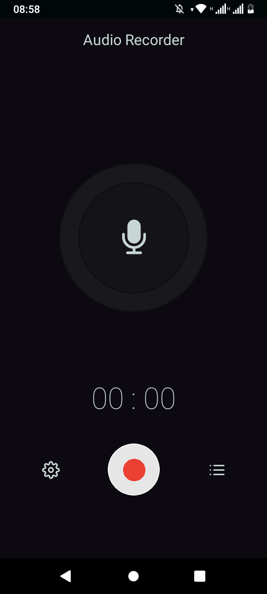
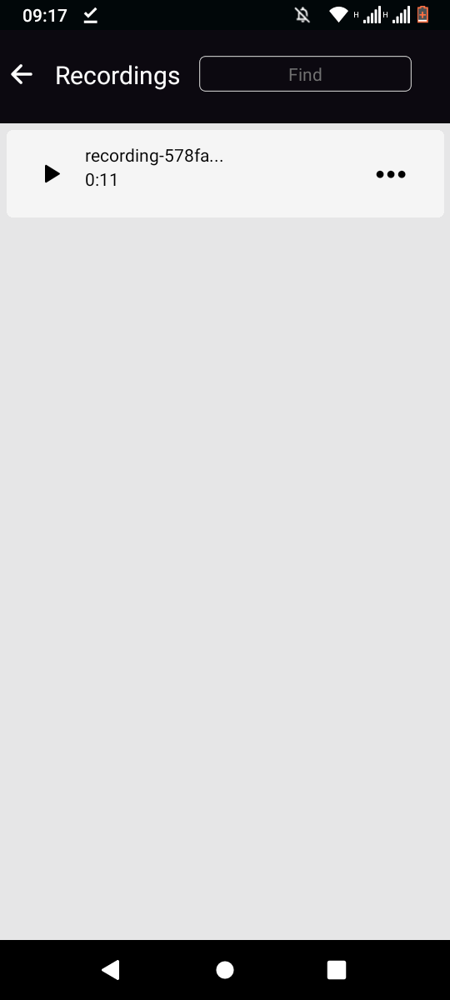

# Audio Recorder App

A simple audio recorder app, where users can record and manage audio.

## Prerequisites

- React Native
- Expo

## Installation

1. Clone the repository

```bash
git@github.com:Lspacedev/audio-recorder.git
```

2. Navigate to the project folder

```bash
cd audio-recorder
```

3.  Install all dependencies

```bash
npm install
```

4. Create an env file and add the following:

```bash
WEB_CLIENT_KEY="Google Drive web client key"
ANDROID_CLIENT_KEY="Google Drive android client key"
```

5. Run the project

```bash
npx expo start
```

In the output, you'll find options to open the app in a

- [development build](https://docs.expo.dev/develop/development-builds/introduction/)
- [Android emulator](https://docs.expo.dev/workflow/android-studio-emulator/)
- [iOS simulator](https://docs.expo.dev/workflow/ios-simulator/)
- [Expo Go](https://expo.dev/go), a limited sandbox for trying out app development with Expo

## Screenshot




## Features

- Record audio.
- Play audio.
- Delete audio.
- Rename audio.
- Backup audio to Google Drive

## Usage

1. Open the app.
2. Record audio.
3. Find all your audios in the recordings tab.

## Tech Stack / Tools

- React Native
- Expo MediaLibrary
- Expo AV
- AsyncStorage
